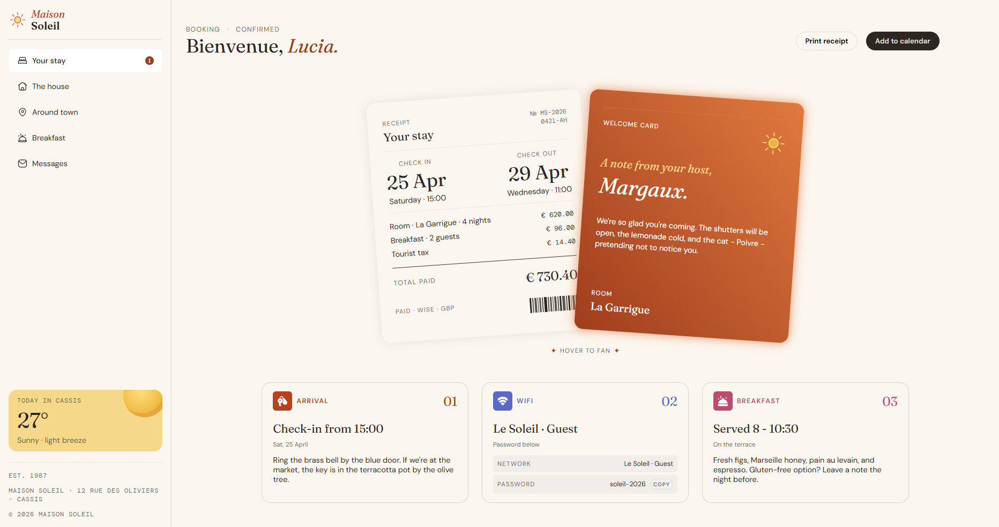

# 🏨 Frontend Mentor - Solución del reto Hotel booking confirmation page

Esta es mi solución al reto [Hotel booking confirmation page de Frontend Mentor](https://www.frontendmentor.io/challenges/hotel-booking-confirmation-page).

## Tabla de contenidos

- [Resumen](#resumen)
  - [El reto](#el-reto)
  - [Captura de pantalla](#captura-de-pantalla)
  - [Enlaces](#enlaces)
- [Mi proceso](#mi-proceso)
  - [Construido con](#construido-con)
  - [Lo que aprendí](#lo-que-aprendí)
  - [Desarrollo continuo](#desarrollo-continuo)
  - [Recursos útiles](#recursos-útiles)
- [Autor](#autor)
- [Agradecimientos](#agradecimientos)

## 💻 Resumen

### El reto

Los usuarios deberían poder:

- Ver la disposición óptima de la interfaz según el tamaño de pantalla del dispositivo
- Visualizar los estados _hover_ (al pasar el cursor) y _focus_ (al enfocar) de todos los elementos interactivos de la página
- Abrir y cerrar el menú de navegación en pantallas más pequeñas (JavaScript opcional)
- Copiar la contraseña de Wi-Fi al portapapeles mediante el botón de copiar (JavaScript opcional)

### Captura de pantalla

### Enlaces

- URL de la solución:
- URL del sitio en vivo:

## 💪 Mi proceso

### Construido con

- HTML5 semántico
- JavaScript ES6+
- Propiedades personalizadas de CSS
- Grid
- Flexbox

### Lo que aprendí

Aprendí a como utilizar el atributo inert en el html para ocultar elementos del teclado y herramientas como lectores de pantalla, lo cual me resultó bastante útil al momento de ocultar el menú en movil.

También aprendí a como copiar texto desde JavaScript utilizando la API clipboard del navegador; como ya había manejado con anterioridad el asincronismo utilizando `async - await`, me resultó bastante untuitiva de implementar.

Descubrí una forma de alertar a las herramientas de accesibilidad sobre un cambio, por medio de `role="status"`.

### Desarrollo continuo

Me gustaría seguir aprendiendo y reforzando mis conocimientos en HTML, CSS y JavaScript.

Una vez sienta que he interiorizado las bases, seguiré con el manejo de información dinámica con JSON y otras herramientas.

### Recursos útiles

- [MDN Web Docs](https://developer.mozilla.org/es/) - Este recurso es muy bueno y me ayuda sobre todo a escoger funciones y características que funcionan en cualquier navegador.
- [W3Schools](https://www.w3schools.com/cssref/pr_gen_quotes.php) - Este recurso me ayuda a entender las propiedades CSS cuando tengo dudas.
- [CSS Scan - CSS box shadow examples](https://getcssscan.com/css-box-shadow-examples) - Este recurso me ayuda a escoger sombras para elementos.
- [CSS Tricks](https://css-tricks.com/) - Muy buen recurso para aprender trucos útiles de maquetado.

## 🤓 Autor

- Frontend Mentor - [Angel López](https://www.frontendmentor.io/profile/angeldavid04)

## ♥️ Agradecimientos

Le quiero dar un agradecimiento a mis maestros del bachillerato y la universidad porque sin ellos no fuera quien soy ahora, JonMircha por ser un gran docente digital y por enseñarme los fundamentos del maravilloso mundo del desarrollo web, Lucas Dalto por ofrecerme muy buenos cursos para aprender y repasar.
